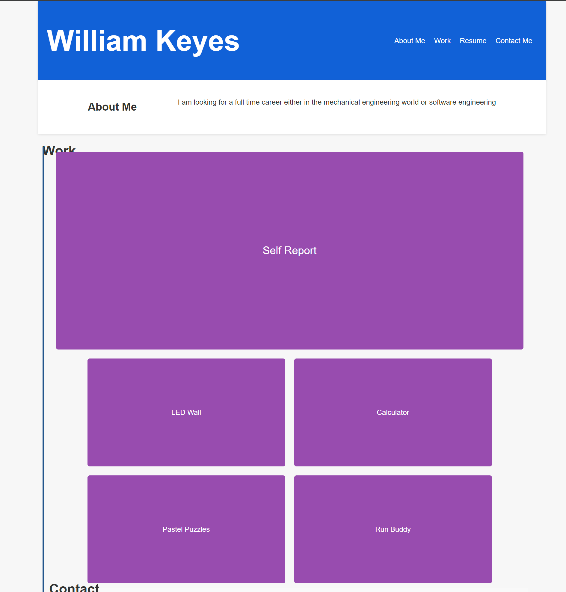

# React Portfolio

## Description

This is my portfolio that i created using React. 



## Table of Contents

- [Installation](#installation)
- [Usage](#usage)
- [Contributing](#contributing)
- [Tests](#tests)
- [Questions](#questions)
- [License](#license)

## Installation

```
Do an npm i and then do an npm run dev
```

## Usage

It is used to display my projects and let people contact me.

## Contributing

They could add more pages or links to my other projects.

## Tests

```
They really cant be other than just running the app.
```

## Questions

If you have any questions about the repo, open an issue or contact me directly at willkeyes01@gmail.com. You can find more of my work at [https://github.com/WillKeyes](https://github.com/https://github.com/WillKeyes).

## License

This project is licensed under the MIT license.